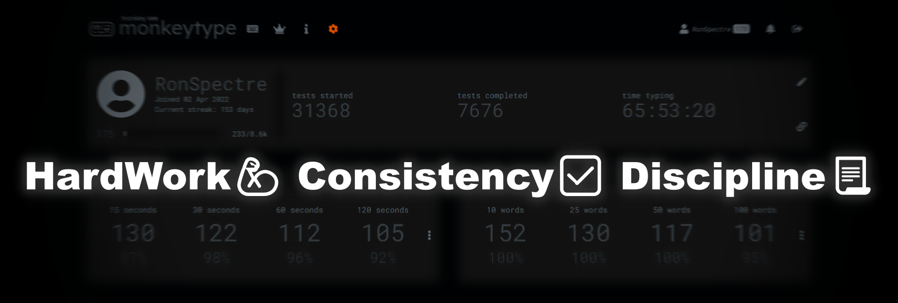

<h1 align="center"> Hi  I'm <b>Rohan Tiwari</b></h1>
<h2 align="center"><b>I'm a Passionate for Problem Solving and Learning Competitive Programming & Development from India :india:</b></h2>
<h4 align="center"><b>Contest Rating 2837 & 2 Times College Topper🏆@CodingNinja || Problem Solving Enthusiast || 2⭐CodeChef(max.1406) || 110+WPM || B.Tech CSE@DITU'26 || Proficient in C, C++, HTML, and CSS
</b></h4> 

<h2>🙋‍♂️ABOUT ME</h2>
- 🧑‍🎓 I'm passionate for Programming and Problem-Solving. I am always curious to learn new skills with Effective Idea's 
- 👨‍💻 Love to learn new technologies and to explore new set of areas. 
- ⌨️ I'am a mechanical keyboard enthusiast and have 110+ Word Per Minutes typing speed <a href="https://monkeytype.com/profile/RonSpectre"><b>MonkeyType</b></a> 
- 👁‍🗨 What's Special about me?  
Ability to quickly Learn and Master a new skill and to implement it to solve a realtime problems, and having a constant desire to learn and stay informed about emerging technologies in the tech world. 
- 📚 I'm Currently Studing in **2nd Year** 
- 📘 I’m Currently learning **Full Stack Web Development & Advanced DSA** 
- 🎈 For fun **Games, Reddit, Hip-Hop music** 
- 📫 How to reach me <a href="mailto:rohantiwari2709@gmail.com"><b>Mail</b></a> 
- 🔗 Connect Me on <a href="https://www.linkedin.com/in/rohan-tiwarii/"><b>LinkedIn</b></a>   

<h2>💖 DSA Zone</h2>

    <button></button>
    
    
     
    
    
    
    
    
    
    

<h2> Achievements</h2>

<b> <a href= "https://www.codingninjas.com/studio/profile/rohan_tiwari">CodingNinja/Studio</a></b>  
- Weekend Contest Rating <b>2837</b> 
- 🏆2 Time College Topper 
- Level 7(Expert) 
- 40000+ EXP gained 
- 815+ Problems Solved 
- 75+ Days of Coding Streak 
- Ninja Dominator league 

<b> <a href= "https://www.codechef.com/users/rohantiwari">CodeChef</a></b> 
- 105+ Days of Coding Streak 
- 450+ Problems Solved 
- 1082+ 1v1 Rating 
- Highest Rating 1402 
- 18+ Contests Participated   

<b> <a href= "https://leetcode.com/rohantiwari2709/">Leetcode</a></b>  
- 77+ Questions Solved 
- 72+ Days of Coding Streak  

<b> <a href= "https://codeforces.com/profile/tiwarirohan">CodeForces</a></b>  
- 85+ Problems Solved 
- 87+ Days of Coding Streak 
- Contest rating: max. newbie, 887  

<b> <a href= "https://codeforces.com/profile/tiwarirohan">GeeksForGeeks</a></b>  
- 81+ Problems Solved 
- 147+ Coding Score 
- 197 Institute Rank   

<b> <a href= "https://www.hackerrank.com/rohantiwari2709?hr_r=1">HackerRank</a></b>  
- 3⭐ Badge in C++ 
- 2⭐ Badge in C 
- 2⭐ Badge in Java 
- 1⭐ Problem Solving 
- 330+ Hackos  

<b> <a href= "https://www.hackerearth.com/@rohantiwari2709">HackerEarth</a></b>  
- 2⭐ Basic Programming 
- 1⭐ Algorithms 
- Level Amateure 
- 12+ Problems Solved 
- 14+ Days of Coding Streak 
- 200+ Points  

<b> <a href= "https://monkeytype.com/profile/RohanTiwari">Monkeytype</a></b>  
- 228+ Level Experience 
- 236+ Days of Typing Practice Streak 
- Max 129 WPM in 30sec test 
- Max 126 WPM in 60sec test 
- 110+ WPM Average Typing Speed  

<h2>🚀Languages and Tools</h2>  

 
    
    
    
    
    
    
    
    
    
    
    
    
    
    
    

<h2> My Github Stats</h2> 

   
 
     

   
   
  

    
   

  

   
  
  

  

  
  <b>Note:</b> Top languages is only a metric of the languages my public code consists of and doesn't reflect experience or skill level.

 
 

 

